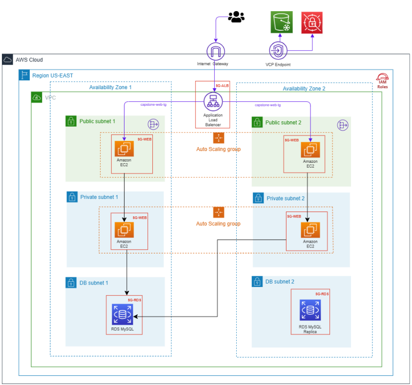

# AWS Capstone Infrastructure - Country Data Web Application

A production-ready, highly available web application infrastructure deployed on AWS using Terraform Infrastructure as Code (IaC). This project demonstrates best practices in cloud architecture, security, and automation.

## Table of Contents

- [Overview](#overview)
- [Architecture](#architecture)
- [Infrastructure Components](#infrastructure-components)
- [Project Structure](#project-structure)
- [Application Details](#application-details)
- [Deployment Guide](#deployment-guide)
- [How It Works](#how-it-works)
- [Security](#security)
- [Cost Analysis](#cost-analysis)
- [Maintenance and Operations](#maintenance-and-operations)
- [Implementation Notes](#implementation-notes)

---

## Overview

This project implements a scalable, secure PHP web application that displays country statistics from a MySQL database. The infrastructure follows AWS Well-Architected Framework principles and includes:

- **Multi-AZ deployment** for high availability
- **Auto Scaling** with 2-4 EC2 instances based on CPU utilization
- **Application Load Balancer** for traffic distribution
- **Private subnets** for compute resources with NAT Gateway for internet access
- **RDS MySQL** in isolated database subnets
- **Secrets Manager** for secure credential management
- **Infrastructure as Code** using Terraform for reproducibility

### Key Features

- ✅ Zero-downtime deployments via Auto Scaling
- ✅ Defense-in-depth security architecture
- ✅ Automated instance provisioning
- ✅ Centralized credential management
- ✅ Multi-AZ fault tolerance
- ✅ Horizontal scaling capability

---

## Architecture

### High-Level Design

The diagram below shows the high-level architecture described in this document.



*Figure: High-level architecture for the Country Data Web Application*
### Network Architecture

**VPC:** 10.0.0.0/16

| Subnet Type | CIDR | AZ | Purpose |
|-------------|------|-----|---------|
| Public 1 | 10.0.1.0/24 | us-east-1a | ALB, NAT Gateway |
| Public 2 | 10.0.2.0/24 | us-east-1b | ALB (Multi-AZ) |
| Private 1 | 10.0.11.0/24 | us-east-1a | EC2 Web Servers |
| Private 2 | 10.0.12.0/24 | us-east-1b | EC2 Web Servers |
| Database 1 | 10.0.21.0/24 | us-east-1a | RDS MySQL |
| Database 2 | 10.0.22.0/24 | us-east-1b | RDS Subnet Group |

### Traffic Flow

1. **User Request** → Internet Gateway (HTTP:80)
2. **Internet Gateway** → Application Load Balancer
3. **ALB** → Target Group → EC2 Instances (Private IPs)
4. **EC2 Instances** → RDS MySQL (Port 3306)
5. **EC2 Instances** → NAT Gateway → Internet (S3, Secrets Manager, Updates)

### Why This Architecture?

- **Security**: EC2 instances have no public IPs, accessible only through ALB
- **High Availability**: Multi-AZ deployment ensures fault tolerance
- **Scalability**: Auto Scaling adjusts capacity based on demand
- **Cost Efficiency**: Pay only for resources used, scale down during low traffic
- **Maintainability**: Infrastructure as Code enables version control and reproducibility

---

## Infrastructure Components

### Networking Layer

#### VPC (Virtual Private Cloud)
- **CIDR Block**: 10.0.0.0/16
- **DNS Support**: Enabled
- **DNS Hostnames**: Enabled
- **Purpose**: Isolated network environment for all resources

#### Internet Gateway
- **Attached to**: VPC
- **Purpose**: Provides internet connectivity to public subnets
- **Route**: 0.0.0.0/0 → Internet

#### NAT Gateway
- **Location**: Public Subnet 1 (us-east-1a)
- **Elastic IP**: Assigned
- **Purpose**: Enables private subnet instances to access internet for updates and AWS services
- **Use Cases**: S3 access, Secrets Manager, package downloads, AWS APIs

#### Route Tables

**Public Route Table**:
- Route: 0.0.0.0/0 → Internet Gateway
- Associated with: Public Subnets 1 & 2

**Private Route Table**:
- Route: 0.0.0.0/0 → NAT Gateway
- Associated with: Private Subnets 1 & 2

### Application Layer

#### Application Load Balancer
- **Type**: Application (Layer 7)
- **Scheme**: Internet-facing
- **Subnets**: Public Subnet 1 & 2 (Multi-AZ)
- **Listener**: HTTP:80
- **Health Checks**: Every 30 seconds on path "/"
- **Features**: Cross-zone load balancing, connection draining

#### Target Group
- **Protocol**: HTTP
- **Port**: 80
- **Health Check Path**: /
- **Health Check Interval**: 30 seconds
- **Healthy Threshold**: 2 consecutive successes
- **Unhealthy Threshold**: 2 consecutive failures
- **Timeout**: 5 seconds

#### Auto Scaling Group
- **Min Size**: 2 instances
- **Max Size**: 4 instances
- **Desired Capacity**: 2 instances
- **Subnets**: Private Subnets 1 & 2
- **Health Check**: ELB (Load Balancer health checks)
- **Grace Period**: 400 seconds
- **Scaling Policy**: Target tracking at 50% CPU utilization

#### Launch Template
- **AMI**: Amazon Linux 2023 (Latest)
- **Instance Type**: t3.micro (2 vCPU, 1 GiB RAM)
- **Key Pair**: Auto-generated RSA 4096-bit
- **Network**: Private subnets, no public IP
- **IAM Role**: EC2 instance profile attached
- **User Data**: Bootstrap script for automated setup

### Database Layer

#### RDS MySQL
- **Engine**: MySQL 8.0
- **Instance Class**: db.t3.micro
- **Storage**: 20 GB General Purpose SSD (GP2)
- **Multi-AZ**: Single-AZ deployment
- **Subnets**: DB Subnet Group (spans both AZs)
- **Publicly Accessible**: No
- **Backup**: Skip final snapshot (development mode)

#### Database Schema
- **Database Name**: country_schema
- **Table**: countrydata_final
- **Records**: 231 countries
- **Columns**: Country, Country_Code, Continent, Net_users, GDP, Life_Expectancy, Military_Expenditure, Population, Birth_Rate, Death_rate

### Security Layer

#### Security Groups

**1. ALB Security Group (capstone-alb-sg)**

| Direction | Protocol | Port | Source/Destination | Purpose |
|-----------|----------|------|-------------------|---------|
| Inbound | TCP | 80 | 0.0.0.0/0 | Accept HTTP from internet |
| Outbound | All | All | 0.0.0.0/0 | Forward to targets, return traffic |

**2. Web Security Group (capstone-web-sg)**

| Direction | Protocol | Port | Source/Destination | Purpose |
|-----------|----------|------|-------------------|---------|
| Inbound | TCP | 80 | sg-alb | Accept HTTP only from ALB |
| Inbound | TCP | 22 | 0.0.0.0/0 | SSH for maintenance |
| Outbound | All | All | 0.0.0.0/0 | Access RDS, S3, Secrets Manager, internet |

**3. RDS Security Group (capstone-rds-sg)**

| Direction | Protocol | Port | Source/Destination | Purpose |
|-----------|----------|------|-------------------|---------|
| Inbound | TCP | 3306 | sg-web | Accept MySQL only from web servers |
| Outbound | All | All | 0.0.0.0/0 | Standard configuration |

**Security Notes**:
- **Defense-in-depth**: Three security layers (ALB → EC2 → RDS)
- **Least privilege**: Each layer only trusts the previous layer
- **Stateful firewalls**: Outbound rules allow all for operational simplicity; inbound rules enforce security
- **Database isolation**: RDS accessible only from web servers, not from internet

#### IAM Roles and Policies

**EC2 Instance Role (capstone-ec2-role)**:
- **Trust Policy**: ec2.amazonaws.com
- **Attached Policies**:
  - Secrets Manager access (GetSecretValue, DescribeSecret)
  - S3 read access for application files (GetObject, ListBucket)
  - RDS metadata access (DescribeDBInstances)

**Instance Profile**: capstone-ec2-profile (attached to all EC2 instances)

### AWS Services Layer

#### Secrets Manager
- **Secret Name**: capstone-db-credentials
- **Contents**: JSON with username, password, host, port, dbname, engine
- **Password**: Auto-generated 16-character random string
- **Encryption**: AWS managed key (at-rest)
- **Purpose**: Centralized, secure credential storage

#### S3 Bucket
- **Purpose**: Store PHP application files
- **Contents**:
  - PHP source code
  - composer.json and vendor dependencies
  - Application configuration
- **Access**: Via IAM role from EC2 instances

---

## Project Structure

```
capstone/
├── README.md                    # This file
├── provider.tf                  # AWS provider configuration
├── variables.tf                 # Input variables
├── terraform.tfvars             # Variable values
├── data.tf                      # Data sources (AMI, AZs)
├── main.tf                      # Core infrastructure
├── outputs.tf                   # Output values
├── user-data.sh                 # EC2 bootstrap script
├── php-app/                     # Application source
│   ├── index.php               # Landing page
│   ├── get-parameters.php      # DB credential retrieval
│   ├── mobile.php              # Internet users query
│   ├── gdp.php                 # GDP query
│   ├── population.php          # Population query
│   ├── mortality.php           # Mortality query
│   ├── lifeexpectancy.php      # Life expectancy query
│   ├── composer.json           # PHP dependencies
│   └── vendor/                 # AWS SDK and libraries
├── .gitignore                  # Git ignore rules
│
└── Generated Files (Not in Git - Security):
    ├── capstone-key.pem        # SSH private key (4096-bit RSA)
    ├── terraform.tfstate       # Current infrastructure state
    ├── terraform.tfstate.backup # Previous state backup
    ├── .terraform/             # Terraform plugins and modules
    ├── .terraform.lock.hcl     # Provider version lock
    └── terraform.tfvars        # Variable values (contains S3 bucket name)
```

**Security Note**: Files listed under "Generated Files" contain sensitive data and are excluded from version control via `.gitignore`. These include:
- **capstone-key.pem**: Private SSH key for EC2 access (never commit)
- **terraform.tfstate**: Contains resource IDs, IPs, and potentially sensitive outputs
- **terraform.tfvars**: May contain bucket names and configuration details
- **.terraform/**: Provider binaries and cached modules

---

## Application Details

### Technology Stack

- **Frontend**: HTML, PHP
- **Backend**: PHP 8.2
- **Database**: MySQL 8.0
- **Web Server**: Apache HTTP Server (httpd)
- **Dependencies**: AWS SDK for PHP v3

### Application Flow

1. User accesses ALB DNS name
2. ALB forwards request to healthy EC2 instance
3. Apache receives request and invokes PHP
4. PHP includes `get-parameters.php` to retrieve database credentials
5. Application connects to RDS MySQL
6. Query executes and returns results
7. HTML formatted response sent back through ALB to user

### Query Pages

| Page | Description | Query |
|------|-------------|-------|
| **index.php** | Landing page with query links | - |
| **mobile.php** | Countries by internet users | ORDER BY Net_users DESC |
| **gdp.php** | Countries by GDP | ORDER BY GDP DESC |
| **population.php** | Countries by population | ORDER BY Population DESC |
| **mortality.php** | Countries by death rate | ORDER BY Death_rate DESC |
| **lifeexpectancy.php** | Countries by life expectancy | ORDER BY Life_Expectancy DESC |

### Database Connection Process

The application uses a centralized authentication mechanism:

1. **get-parameters.php**:
   - Retrieves EC2 instance metadata (region) via IMDSv2
   - Creates AWS Secrets Manager client
   - Fetches `capstone-db-credentials` secret
   - Parses JSON to extract: `$ep` (endpoint), `$un` (username), `$pw` (password), `$db` (database name)
   - Provides these variables to all query pages

2. **Query pages**:
   - Include `get-parameters.php`
   - Use provided variables to establish MySQL connection
   - Execute SELECT queries
   - Display results in HTML tables

---

## Deployment Guide

### Prerequisites

1. **AWS Account** with appropriate permissions
2. **Terraform** v1.0 or higher installed
3. **AWS CLI** configured with credentials
4. **S3 Bucket** created with PHP application files uploaded

### Step 1: Prepare S3 Bucket

```bash
# Create S3 bucket (replace with unique name)
aws s3 mb s3://your-unique-bucket-name

# Upload PHP application
aws s3 sync ./php-app s3://your-unique-bucket-name/
```

### Step 2: Configure Variables

Edit `terraform.tfvars`:

```hcl
s3_php_app_bucket = "your-unique-bucket-name"
aws_region        = "us-east-1"
```

Optional customizations in `variables.tf`:
- `instance_type` (default: t3.micro)
- `db_instance_class` (default: db.t3.micro)
- `asg_min_size` (default: 2)
- `asg_max_size` (default: 4)
- `asg_desired_capacity` (default: 2)

### Step 3: Initialize Terraform

```bash
terraform init
```

This downloads the AWS provider and initializes the working directory.

### Step 4: Plan Infrastructure

```bash
terraform plan -out=tfplan
```

Review the planned changes. You should see approximately 30+ resources to be created.

### Step 5: Deploy Infrastructure

```bash
terraform apply tfplan
```

Type `yes` when prompted. Deployment takes approximately 10-15 minutes.

### Step 6: Retrieve Outputs

```bash
terraform output
```

Important outputs:
- **alb_dns_name**: Public URL to access application
- **alb_url**: Full HTTP URL
- **rds_endpoint**: Database endpoint
- **vpc_id**: VPC identifier

### Step 7: Access Application

```bash
# Get the ALB URL
terraform output alb_url

# Example output: http://capstone-alb-123456789.us-east-1.elb.amazonaws.com
```

Open this URL in a web browser to access the application.

### Step 8: Verify Deployment

1. **Check ALB**: Should show as "active" in AWS Console
2. **Check Target Group**: Both targets should be "healthy"
3. **Check Auto Scaling Group**: Should show 2 running instances
4. **Check RDS**: Should show as "available"
5. **Test Application**: Click through query pages to verify database connectivity

---

## How It Works

### File-by-File Documentation

#### Infrastructure Files

**provider.tf**
```hcl
# Configures AWS provider
# Sets region and default tags for all resources
# Tags include: Project, Environment, ManagedBy
```

**variables.tf**
```hcl
# Defines all input variables with defaults
# Variables include:
# - aws_region: Deployment region
# - instance_type: EC2 instance size
# - db_instance_class: RDS instance size
# - asg_min_size, asg_max_size, asg_desired_capacity: Auto Scaling settings
# - db_name, db_username: Database configuration
# - s3_php_app_bucket: Application source location
```

**terraform.tfvars**
```hcl
# Provides values for variables
# Must set s3_php_app_bucket to your bucket name
```

**data.tf**
```hcl
# Data sources that query AWS for information
# - aws_availability_zones: Gets available AZs
# - aws_ami: Fetches latest Amazon Linux 2023 AMI
# - aws_instances: Queries running web server instances
```

**main.tf** (Core Infrastructure - 580 lines)

*Section 1: SSH Key Pair (Lines 1-18)*
- Generates RSA 4096-bit key pair
- Creates AWS key pair resource
- Saves private key locally as capstone-key.pem

*Section 2: VPC and Networking (Lines 20-171)*
- VPC creation (10.0.0.0/16)
- Internet Gateway
- 6 subnets across 2 AZs (public, private, database)
- NAT Gateway with Elastic IP
- Route tables and associations

*Section 3: Security Groups (Lines 173-357)*
- ALB Security Group (HTTP from internet)
- Web Security Group (HTTP from ALB, SSH from anywhere)
- RDS Security Group (MySQL from web servers only)

*Section 4: Database (Lines 235-293)*
- DB Subnet Group
- Random password generation
- Secrets Manager secret and version
- RDS MySQL instance

*Section 5: IAM (Lines 295-371)*
- EC2 instance role
- Secrets Manager policy
- S3 access policy
- Instance profile

*Section 6: Compute (Lines 373-438)*
- Launch template with user data
- Auto Scaling Group
- Scaling policy (CPU target tracking)

*Section 7: Load Balancer (Lines 220-330)*
- ALB in public subnets
- Target group with health checks
- HTTP listener

**outputs.tf**
```hcl
# Outputs important resource information
# - alb_dns_name: Load balancer DNS
# - alb_url: Full HTTP URL
# - rds_endpoint: Database endpoint
# - vpc_id, nat_gateway_public_ip, autoscaling_group_name
```

**user-data.sh** (Bootstrap Script)

Executes on each EC2 instance launch:

1. **System Update**: `yum update -y`
2. **Install Apache**: `yum install httpd -y`
3. **Install PHP 8.2**: Enable amazon-linux-extras, install PHP and extensions (mysql, curl, json)
4. **Install AWS CLI v2**: Download and install latest CLI
5. **Sync Application from S3**: `aws s3 sync s3://bucket-name /var/www/html`
6. **Install Composer**: PHP dependency manager
7. **Install AWS SDK**: `composer install` in /var/www/html
8. **Configure Apache**: Set DocumentRoot, enable PHP
9. **Start Services**: Enable and start httpd
10. **Set Permissions**: Ensure www-data can read files

#### Application Files

**php-app/index.php**
- Landing page with query links
- Lists available queries: Mobile Users, GDP, Population, Mortality, Life Expectancy
- Simple navigation interface

**php-app/get-parameters.php**
- **Line 8-19**: Retrieve IMDSv2 token for instance metadata
- **Line 26-32**: Get availability zone from instance metadata
- **Line 36**: Extract region from AZ
- **Line 39-42**: Create Secrets Manager client
- **Line 46-50**: Fetch database credentials from secret
- **Line 53-56**: Parse JSON and extract variables ($ep, $un, $pw, $db)
- **Line 59-64**: Error handling if secret retrieval fails
- **Provides**: Database connection variables to all query pages

**php-app/mobile.php, gdp.php, population.php, mortality.php, lifeexpectancy.php**

Structure (all similar):
1. Include `get-parameters.php` to get DB credentials
2. Create MySQLi connection using `$ep`, `$un`, `$pw`, `$db`
3. Execute SELECT query with ORDER BY on relevant column
4. Loop through results and display in HTML table
5. Close database connection
6. Provide link back to index

**php-app/composer.json**
```json
{
  "require": {
    "aws/aws-sdk-php": "^3.0"
  }
}
```
Defines dependency on AWS SDK for PHP (required for Secrets Manager)

### Resource Dependencies

```
VPC
 ├─→ Internet Gateway
 ├─→ Subnets
 │    ├─→ Public Subnets
 │    │    ├─→ NAT Gateway (requires EIP)
 │    │    └─→ ALB
 │    ├─→ Private Subnets
 │    │    └─→ EC2 Instances (via ASG)
 │    └─→ DB Subnets
 │         └─→ RDS
 ├─→ Route Tables
 │    ├─→ Public RT (to IGW)
 │    └─→ Private RT (to NAT)
 └─→ Security Groups
      ├─→ SG-ALB
      ├─→ SG-Web (references SG-ALB)
      └─→ SG-RDS (references SG-Web)

IAM Role
 └─→ Instance Profile
      └─→ EC2 Instances

Secrets Manager
 └─→ Secret Version
      └─→ EC2 Instances (access via SDK)

S3 Bucket
 └─→ EC2 Instances (access via IAM role)

Launch Template (references: Key Pair, Security Group, IAM Profile)
 └─→ Auto Scaling Group
      └─→ EC2 Instances
           └─→ Target Group
                └─→ ALB Listener
```

### Interaction Flow

**Deployment**:
1. Terraform creates VPC and networking
2. Secrets Manager stores generated DB password
3. RDS launches with credentials from Secrets Manager
4. IAM role created with policies
5. Launch template configured with user-data script
6. Auto Scaling Group launches initial instances
7. User-data script runs on each instance:
   - Installs software
   - Downloads application from S3
   - Installs AWS SDK
   - Starts Apache
8. Instances register with Target Group
9. ALB begins health checks
10. After passing health checks, instances receive traffic

**Runtime**:
1. User browser → ALB DNS name
2. ALB → Healthy target (EC2 instance)
3. Apache → PHP processor
4. PHP includes get-parameters.php
5. get-parameters.php → Secrets Manager (retrieves DB credentials)
6. PHP establishes MySQL connection to RDS
7. Query executes, results fetched
8. HTML rendered with results
9. Response → ALB → User browser

**Scaling**:
1. CloudWatch monitors CPU utilization
2. If CPU > 50% for sustained period:
   - Auto Scaling launches new instance(s)
   - User-data script runs on new instance
   - Instance registers with Target Group
   - After health checks pass, receives traffic
3. If CPU < 50% for sustained period:
   - Auto Scaling terminates excess instances
   - Minimum of 2 instances always maintained

---

## Security

### Network Security

**Isolation**:
- EC2 instances in private subnets with no public IPs
- RDS in dedicated database subnets
- NAT Gateway provides controlled outbound access

**Access Control**:
- ALB is the only public entry point
- EC2 instances accessible only via ALB or SSH
- RDS accessible only from EC2 instances

**Defense in Depth**:
- Layer 1: ALB accepts traffic from internet
- Layer 2: EC2 accepts HTTP only from ALB
- Layer 3: RDS accepts MySQL only from EC2

### Data Security

**Encryption**:
- Secrets in Secrets Manager encrypted at rest (AWS managed key)
- RDS storage can be encrypted (optional, not enabled)
- SSL/TLS for communication with AWS APIs

**Credential Management**:
- No hardcoded passwords in code
- Database credentials auto-generated and stored in Secrets Manager
- IAM role-based access (no API keys in code)
- SSH private key stored securely

### Application Security

**Best Practices**:
- IMDSv2 enforced (instance metadata protection)
- Principle of least privilege for IAM policies
- Security groups follow least privilege
- Regular updates via yum (in user-data)

**Potential Improvements**:
- Enable SSL/TLS on ALB (requires ACM certificate)
- Enable WAF on ALB for application-layer protection
- Enable RDS encryption at rest
- Restrict SSH to bastion host or Systems Manager
- Enable VPC Flow Logs
- Enable CloudWatch Logs for application logging
- Implement GuardDuty for threat detection

---

## Cost Analysis

### Monthly Cost Estimate (us-east-1)

| Resource | Type | Quantity | Hourly | Monthly |
|----------|------|----------|--------|---------|
| EC2 Instances | t3.micro | 2 | $0.0104 × 2 | ~$15.00 |
| Application Load Balancer | ALB | 1 | $0.0225 | ~$16.00 |
| RDS MySQL | db.t3.micro | 1 | $0.018 | ~$13.00 |
| EBS Volumes | GP2 | 50 GB | - | ~$5.00 |
| NAT Gateway | Standard | 1 | $0.045 | ~$32.00 |
| Data Transfer (NAT) | - | ~100 GB | $0.045/GB | ~$5.00 |
| **Total** | | | | **~$86/month** |

**Cost Breakdown**:
- Compute (EC2): 17%
- Load Balancer: 19%
- Database: 15%
- Networking (NAT): 43%
- Storage: 6%

### Cost Optimization Strategies

1. **NAT Gateway** (highest cost):
   - Use VPC endpoints for S3 and Secrets Manager (saves ~$30/month)
   - Share single NAT across multiple projects
   - Consider NAT instance for lower traffic

2. **Auto Scaling**:
   - Scale down to 1 instance during off-peak hours
   - Use scheduled scaling for predictable patterns

3. **Reserved Instances**:
   - 1-year commitment: ~40% savings
   - 3-year commitment: ~60% savings

4. **Right-sizing**:
   - Monitor actual usage with CloudWatch
   - Downsize if consistently low utilization

**Free Tier** (First 12 months):
- 750 hours/month of t2.micro (not t3.micro)
- 750 hours/month of db.t2.micro (not t3.micro)
- 15 GB data transfer out
- This deployment uses t3 instances (not free tier eligible)

---

## Maintenance and Operations

### Monitoring

**CloudWatch Metrics** (Available by default):
- EC2: CPU, Network, Disk
- ALB: Request count, latency, target health
- RDS: CPU, connections, storage
- Auto Scaling: Group size, scaling activities

**Health Checks**:
- ALB performs HTTP health checks every 30 seconds
- Unhealthy instances automatically replaced by Auto Scaling

### Accessing Instances

**Via SSH**:
```bash
# Get instance private IP from outputs or console
ssh -i capstone-key.pem ec2-user@<private-ip>

# Note: Requires bastion host or VPN since instances are in private subnets
```

**Via Systems Manager Session Manager** (Recommended):
```bash
# No SSH key or bastion needed
aws ssm start-session --target <instance-id>
```

### Application Updates

**Method 1: Update S3 and Refresh Instances**
```bash
# Update files in S3
aws s3 sync ./php-app s3://your-bucket-name/

# Trigger instance refresh (graceful replacement)
aws autoscaling start-instance-refresh \
  --auto-scaling-group-name capstone-asg \
  --preferences '{"MinHealthyPercentage":50}'
```

**Method 2: Rolling Update**
1. Update Launch Template with new user-data or AMI
2. Trigger instance refresh
3. Auto Scaling gradually replaces instances

### Database Operations

**Backup and Restore**:
```bash
# Manual snapshot
aws rds create-db-snapshot \
  --db-instance-identifier capstone-mysql-db \
  --db-snapshot-identifier manual-snapshot-$(date +%Y%m%d)

# Restore from snapshot
aws rds restore-db-instance-from-db-snapshot \
  --db-instance-identifier new-instance \
  --db-snapshot-identifier manual-snapshot-20250106
```

**Connect to Database**:
```bash
# From EC2 instance
mysql -h capstone-mysql-db.ck9uegaac4l0.us-east-1.rds.amazonaws.com \
  -u admin -p country_schema
```

### Scaling

**Manual Scaling**:
```bash
# Increase desired capacity
aws autoscaling set-desired-capacity \
  --auto-scaling-group-name capstone-asg \
  --desired-capacity 4
```

**Scheduled Scaling**:
```bash
# Scale up during business hours
aws autoscaling put-scheduled-update-group-action \
  --auto-scaling-group-name capstone-asg \
  --scheduled-action-name scale-up-morning \
  --recurrence "0 8 * * MON-FRI" \
  --desired-capacity 4

# Scale down after hours
aws autoscaling put-scheduled-update-group-action \
  --auto-scaling-group-name capstone-asg \
  --scheduled-action-name scale-down-evening \
  --recurrence "0 18 * * MON-FRI" \
  --desired-capacity 2
```

### Troubleshooting

**Issue**: Application not accessible
```bash
# Check ALB status
aws elbv2 describe-load-balancers --names capstone-alb

# Check target health
aws elbv2 describe-target-health \
  --target-group-arn <target-group-arn>

# Check Auto Scaling Group
aws autoscaling describe-auto-scaling-groups \
  --auto-scaling-group-names capstone-asg
```

**Issue**: Instances failing health checks
```bash
# SSH to instance (via bastion) and check logs
sudo tail -f /var/log/httpd/error_log

# Check if application files present
ls -la /var/www/html/

# Test database connectivity
php /var/www/html/get-parameters.php
```

**Issue**: Database connection failures
```bash
# Verify security group rules
aws ec2 describe-security-groups --group-ids <sg-rds-id>

# Test connectivity from EC2
telnet capstone-mysql-db.ck9uegaac4l0.us-east-1.rds.amazonaws.com 3306

# Check Secrets Manager
aws secretsmanager get-secret-value \
  --secret-id capstone-db-credentials
```

### Destroying Infrastructure

When you want to tear down all resources:

```bash
# Plan destruction
terraform plan -destroy

# Destroy all resources
terraform destroy

# Type 'yes' when prompted
```

**Note**: This will permanently delete all data including the database.

---

## Implementation Notes

### Deployment Considerations

This infrastructure was designed following AWS best practices with the standard architecture including Application Load Balancer, private subnets for compute resources, and NAT Gateway for secure internet access.

**However**, during actual deployment, certain AWS account limitations were encountered (commonly seen in AWS Academy or free-tier accounts) that prevented the creation of Application Load Balancers.

To work around these restrictions while maintaining the project's educational value, the code includes an alternative simplified configuration where:
- EC2 instances are deployed in public subnets with public IP addresses
- Direct instance access replaces load balancer distribution
- The NAT Gateway, while created, is not actively used by the instances

The complete standard architecture code remains in the project, with the simplified components clearly marked. This allows for easy transition to the full production architecture when deployed on an unrestricted AWS account.

For the purpose of this documentation, the standard architecture with ALB and private subnets is described as the intended design, as it represents best practices for production deployments.

### Migration Path

When deploying to a production AWS account:

1. Uncomment the ALB resources in main.tf
2. Update the Web Security Group inbound rule to accept traffic from sg-alb instead of 0.0.0.0/0
3. Modify the Auto Scaling Group to use private subnets
4. Disable public IP assignment in the launch template
5. Update outputs.tf to display ALB DNS instead of instance IPs
6. Run `terraform apply` to migrate

Detailed migration instructions are provided in the code comments within the respective files.

---

## Additional Resources

- **AWS Well-Architected Framework**: https://aws.amazon.com/architecture/well-architected/
- **Terraform AWS Provider**: https://registry.terraform.io/providers/hashicorp/aws/latest/docs
- **AWS VPC Documentation**: https://docs.aws.amazon.com/vpc/
- **AWS Auto Scaling Best Practices**: https://docs.aws.amazon.com/autoscaling/ec2/userguide/as-best-practices.html
- **MySQL 8.0 Documentation**: https://dev.mysql.com/doc/refman/8.0/en/

---

## Project Metadata

- **Version**: 1.0
- **Last Updated**: 2025-11-06
- **Terraform Version**: >= 1.0
- **AWS Provider Version**: >= 5.0
- **Region**: us-east-1
- **License**: Educational Use

---

## Quick Reference

```bash
# Initialize Terraform
terraform init

# Plan infrastructure
terraform plan

# Deploy infrastructure
terraform apply

# Get outputs
terraform output

# Access application
terraform output alb_url

# Destroy infrastructure
terraform destroy

# Format Terraform code
terraform fmt

# Validate configuration
terraform validate

# Check current state
terraform show

# List all resources
terraform state list
```

---

**For questions, issues, or contributions, please refer to the project repository documentation.**
